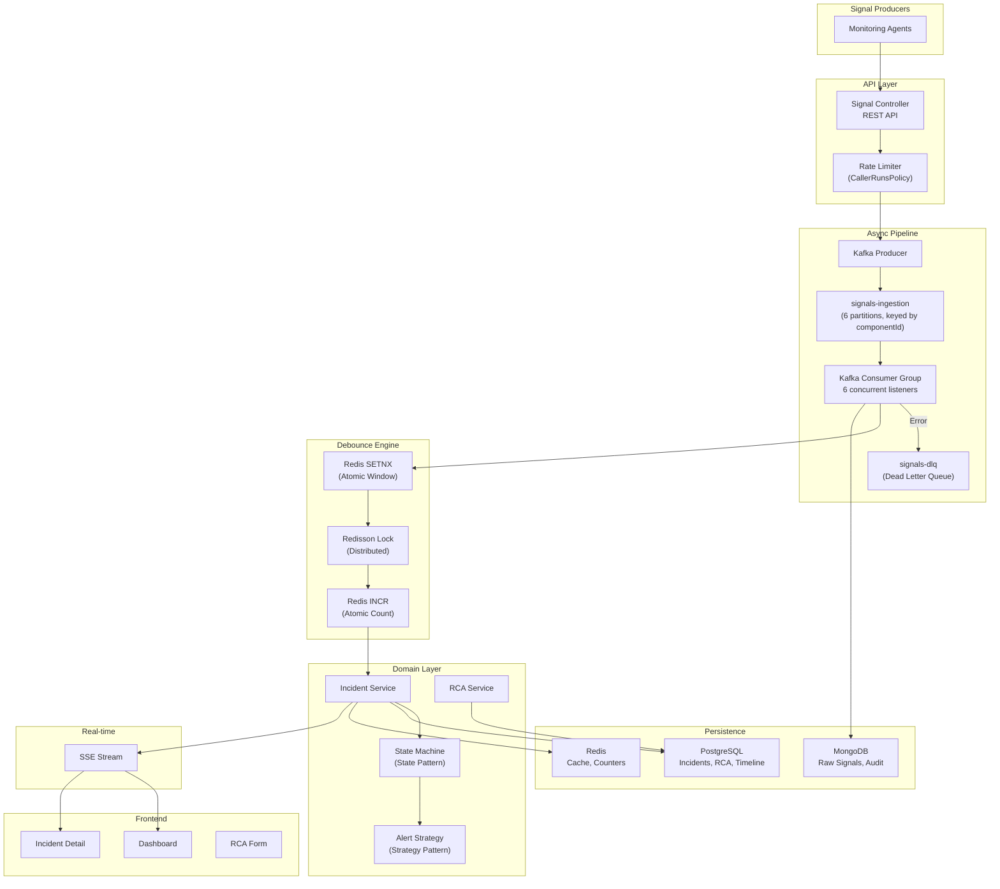

# 🚨 Mission-Critical Incident Management System (IMS)

> Production-grade SRE incident management platform for signal ingestion, intelligent debouncing, incident lifecycle management, and root cause analysis.

[](https://openjdk.org/projects/jdk/21/)
[](https://spring.io/projects/spring-boot)
[](https://react.dev)
[](https://www.typescriptlang.org/)
[](LICENSE)

---

## 📐 Architecture



## 🏗️ Repository Structure

```
incident-management-system/
├── backend/                          # Java Spring Boot 3
│   ├── src/main/java/com/ims/
│   │   ├── config/                   # Kafka, Redis, Swagger, Web configs
│   │   ├── controller/               # REST controllers (thin)
│   │   ├── dto/request/              # Inbound DTOs with validation
│   │   ├── dto/response/             # Outbound DTOs (no entity leak)
│   │   ├── exception/                # Centralized exception handling
│   │   ├── kafka/                    # Producer + Consumer
│   │   ├── metrics/                  # Throughput logger (5s interval)
│   │   ├── model/enums/              # IncidentState, Severity
│   │   ├── model/mongo/              # MongoDB documents
│   │   ├── model/postgres/           # JPA entities
│   │   ├── repository/               # Data access layer
│   │   ├── service/                  # Business logic
│   │   ├── websocket/                # SSE emitter service
│   │   └── workflow/
│   │       ├── state/                # State Pattern (4 handlers + machine)
│   │       └── strategy/             # Strategy Pattern (P0/P1/P2 alerts)
│   └── src/test/                     # JUnit + Mockito tests
├── frontend/                         # React + TypeScript + Vite
│   └── src/
│       ├── api/                      # Axios API client
│       ├── components/               # Sidebar, IncidentCard
│       ├── hooks/                    # SSE, polling hooks
│       ├── pages/                    # Dashboard, IncidentDetail, RcaForm
│       ├── store/                    # Zustand state management
│       └── types/                    # TypeScript interfaces
├── docker/                           # Docker Compose + Prometheus config
├── docs/                             # API documentation
├── prompts/                          # Design specification
└── scripts/                          # Seed data + load test
```

## 🚀 Quick Start

### Prerequisites
- Docker & Docker Compose
- Java 21+
- Node.js 20+
- Maven 3.9+

### Using Docker Compose (Recommended)

```bash
# Start all infrastructure + app
cd docker
docker-compose up -d

# Wait for services to be healthy, then seed data
../scripts/seed-data.sh http://localhost:8080

# Access the app
open http://localhost:3000        # Frontend
open http://localhost:8080/swagger-ui.html  # API docs
open http://localhost:9090        # Prometheus
open http://localhost:3001        # Grafana (admin/admin)
```

### Local Development

```bash
# 1. Start infrastructure only
cd docker
docker-compose up -d postgres mongodb redis kafka zookeeper kafka-init

# 2. Start backend
cd backend
./mvnw spring-boot:run

# 3. Start frontend
cd frontend
npm install
npm run dev

# 4. Seed data
./scripts/seed-data.sh
```

## 🔄 Debouncing — Race Condition Prevention

### Problem
When 100+ signals arrive for the same component within 10 seconds, we must create exactly ONE incident and link all signals to it. Multiple Kafka consumer threads may process signals for the same component simultaneously.

### Solution: Three-Layer Atomic Coordination

```
Layer 1: Redis SETNX (Atomic Window Creation)
├── SET debounce:{componentId} IF NOT EXISTS, TTL=10s
├── Only ONE thread wins (atomic operation)
└── Winner creates the incident

Layer 2: Redis INCR (Atomic Counting)
├── INCR debounce:count:{componentId}
├── Concurrent increments are safe (atomic)
└── Tracks signal count without locks

Layer 3: Redisson Distributed Lock (Incident Creation)
├── LOCK lock:debounce:{componentId}
├── Double-check: re-verify no incident exists
├── Create incident inside lock
└── UNLOCK
```

### Why This Is Race-Condition Safe

1. **SETNX is atomic** — Redis executes it as a single operation. Exactly one thread wins, regardless of concurrency.

2. **INCR is atomic** — Multiple threads can increment the counter simultaneously without data loss.

3. **Distributed Lock with Double-Check** — Even if two threads both see "no incident exists" before the lock, only one can acquire the lock. Inside the lock, we re-verify (double-check pattern), ensuring exactly one incident is created.

4. **TTL auto-expiry** — Debounce windows expire naturally. No cleanup threads, no memory leaks.

5. **Idempotency keys** — Each signal has a unique `signalId`. The `existsBySignalId` check prevents duplicate processing even if Kafka retries delivery.

## ⚡ Backpressure & Throughput

### How We Handle 10,000 signals/sec

```
HTTP Layer → Kafka Producer (async, non-blocking)
           → Returns 202 ACCEPTED immediately
           → Kafka buffers with lz4 compression + 5ms linger

Kafka Consumer → 6 partitions × batch consume (500 records/poll)
              → Manual acknowledgment
              → CallerRunsPolicy on thread pool overflow

Thread Pool: 10 core, 50 max, 10K queue
           → When queue full: CallerRunsPolicy applies backpressure
           → Caller thread slows down, naturally throttling intake
```

### Backpressure Flow
```
Client → API (non-blocking) → Kafka (buffered) → Consumer (batched)
                                                    ↓
                                            Thread Pool Full?
                                           ┌── No → Process
                                           └── Yes → CallerRunsPolicy
                                                      (caller thread processes)
                                                      → Natural slowdown
```

## 🔁 Retry Strategy

### Kafka Level
- **Producer**: 3 retries, idempotent, delivery timeout 30s
- **Consumer**: 3 retries with 1s fixed backoff, then DLQ routing

### Application Level
- `@Retryable` with exponential backoff: 100ms → 200ms → 400ms → max 5000ms
- Only retries `TransientDataAccessException` (DB timeouts, connection issues)
- Non-retryable errors (validation, duplicates) fail fast

### Dead Letter Queue
Failed signals after all retries are published to `signals-dlq` for manual review and replay.

## 🔄 Workflow Engine

### State Pattern
```
OPEN ──────→ INVESTIGATING ──────→ RESOLVED ──────→ CLOSED
                  ↑                     ↑
                  └── reopen ──────────┘

Rules:
• OPEN → INVESTIGATING (start investigation)
• INVESTIGATING → RESOLVED (fix applied, calculates MTTR)
• RESOLVED → CLOSED (requires completed RCA)
• CLOSED is terminal (no transitions out)
```

### Strategy Pattern (Alerting)
```
P0 (Critical) → Page on-call, war room, VP notification, PagerDuty high-urgency
P1 (High)     → Slack #incidents, PagerDuty low-urgency, email team lead
P2 (Medium)   → Slack #incidents-low, daily digest
```

No if-else chains. Strategies are Spring beans auto-registered via `AlertStrategyFactory`.

## 📊 Persistence Architecture

| Store | Data | Why |
|-------|------|-----|
| **PostgreSQL** | Incidents, RCA, Timeline, Signal Links | ACID transactions for state machine correctness. Optimistic locking (`@Version`) prevents concurrent state corruption. |
| **MongoDB** | Raw signals, Audit logs | High write throughput, flexible schema for varying signal metadata, TTL indexes for retention. |
| **Redis** | Dashboard cache, Debounce windows, Counters | Sub-millisecond reads for dashboards, atomic operations for debouncing, TTL for auto-expiry. |

## 📈 Observability

- **`/actuator/health`** — Health check with component details
- **`/actuator/prometheus`** — Prometheus metrics endpoint
- **Throughput Logger** — Logs ingestion/processing rates every 5 seconds
- **Custom Metrics**: `ims.signals.ingested`, `ims.signals.processed`, `ims.signals.failed`, `ims.incidents.created`
- **Swagger UI** — Full interactive API documentation at `/swagger-ui.html`

## 🏗 Scaling Discussion

### Horizontal Scaling
- **Backend**: Stateless — add instances behind load balancer. Kafka consumer group auto-rebalances partitions.
- **Kafka**: Add partitions for higher parallelism (currently 6).
- **PostgreSQL**: Read replicas for dashboard queries, primary for writes.
- **MongoDB**: Sharding by componentId for signal write distribution.
- **Redis**: Redis Cluster for cache scaling, Sentinel for HA.

### Vertical Scaling
- Virtual threads eliminate thread-per-request bottleneck
- HikariCP pool tuned for connection efficiency
- Kafka batch consumption reduces network overhead

## ⚖️ Tradeoff Analysis

| Decision | Pros | Cons |
|----------|------|------|
| Virtual Threads over WebFlux | Simpler code, better debugging, works with blocking libs | Requires Java 21+, preview feature |
| Kafka over in-memory queue | Durability, replay, DLQ, horizontal scale | Operational complexity, Zookeeper dependency |
| Separate PG + Mongo | Right tool for right job, schema flexibility | Two databases to manage, consistency coordination |
| Redis debouncing | Sub-ms latency, atomic ops, TTL expiry | Redis SPOF (mitigated by Sentinel/Cluster) |
| SSE over WebSocket | Simpler protocol, auto-reconnect, HTTP compatible | Unidirectional only (sufficient for dashboards) |
| Optimistic locking | No database locks, better throughput | Retry on conflict (rare for incident updates) |

## 🧪 Testing

```bash
cd backend
./mvnw test
```

Tests cover:
- **State Machine**: All valid/invalid transitions, MTTR calculation, terminal state enforcement
- **Alert Strategy Factory**: Strategy selection by severity, factory dispatch verification
- **RCA Service**: MTTR auto-calculation, duplicate prevention, not-found handling
- **Signal Processing Service**: Idempotency detection, new incident creation, debounce linking, severity escalation
- **Incident Service**: State transitions, RCA requirement enforcement, get/list operations
- **Debounce Service**: SETNX atomicity, double-check pattern, window counting, TTL preservation

## 🔌 API Reference

| Method | Endpoint | Description |
|--------|----------|-------------|
| `POST` | `/api/v1/signals` | Ingest single signal |
| `POST` | `/api/v1/signals/batch` | Batch ingest signals |
| `GET` | `/api/v1/incidents` | List incidents (paginated, filterable) |
| `GET` | `/api/v1/incidents/{id}` | Get incident detail |
| `PUT` | `/api/v1/incidents/{id}/state` | Transition incident state |
| `GET` | `/api/v1/incidents/{id}/signals` | Get signals linked to incident |
| `GET` | `/api/v1/incidents/{id}/timeline` | Get state transition history |
| `GET` | `/api/v1/incidents/stream` | SSE stream for real-time updates |
| `POST` | `/api/v1/incidents/{id}/rca` | Submit root cause analysis |
| `GET` | `/api/v1/incidents/{id}/rca` | Get RCA for incident |
| `GET` | `/api/v1/dashboard` | Aggregated dashboard metrics |
| `GET` | `/actuator/health` | Health check |
| `GET` | `/actuator/prometheus` | Prometheus metrics |
| `GET` | `/swagger-ui.html` | Interactive API documentation |

## 📸 Screenshots

Dashboard and Incident Detail UI screenshots can be captured after running the application with `docker-compose up`.

## 📜 License

MIT

