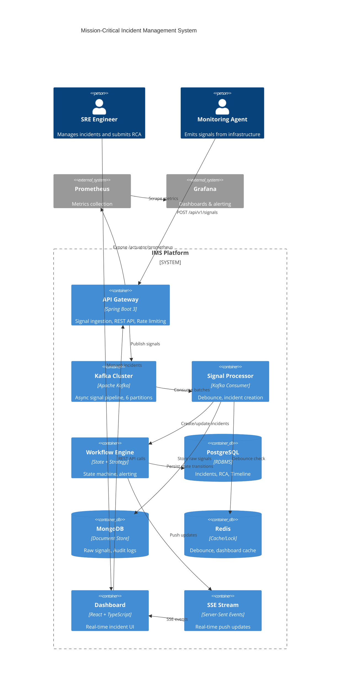
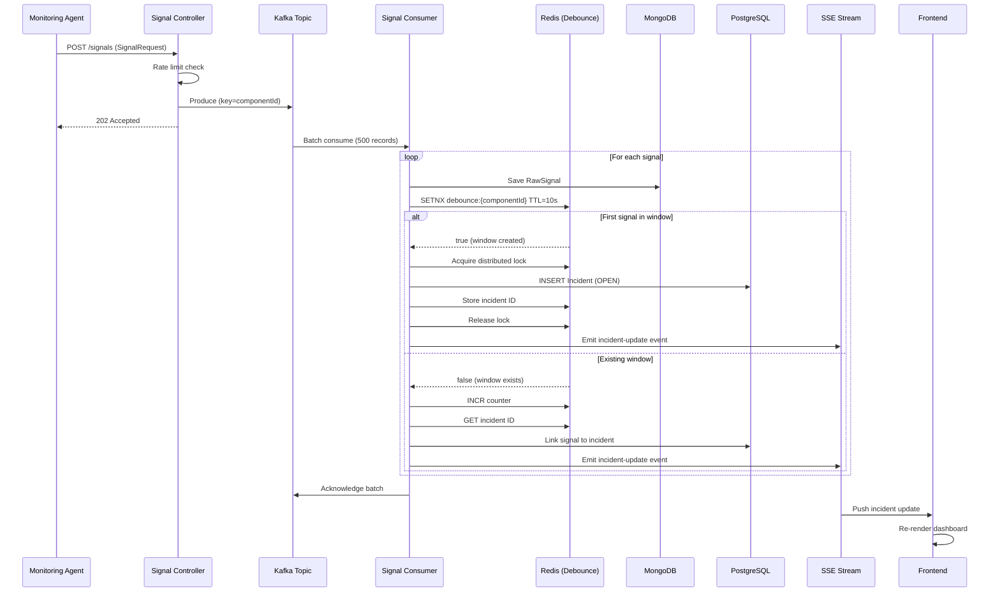
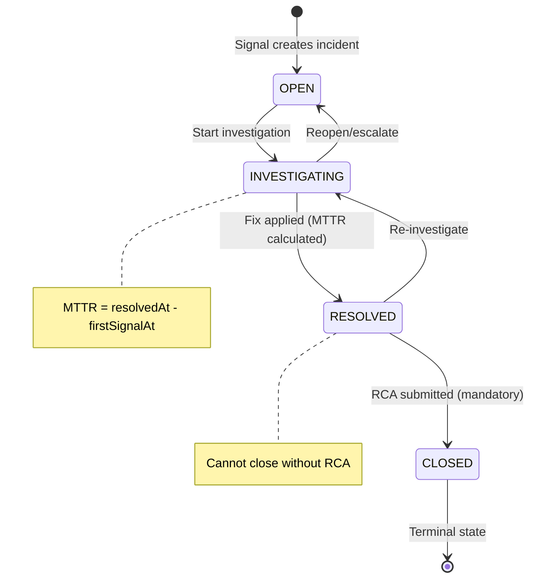
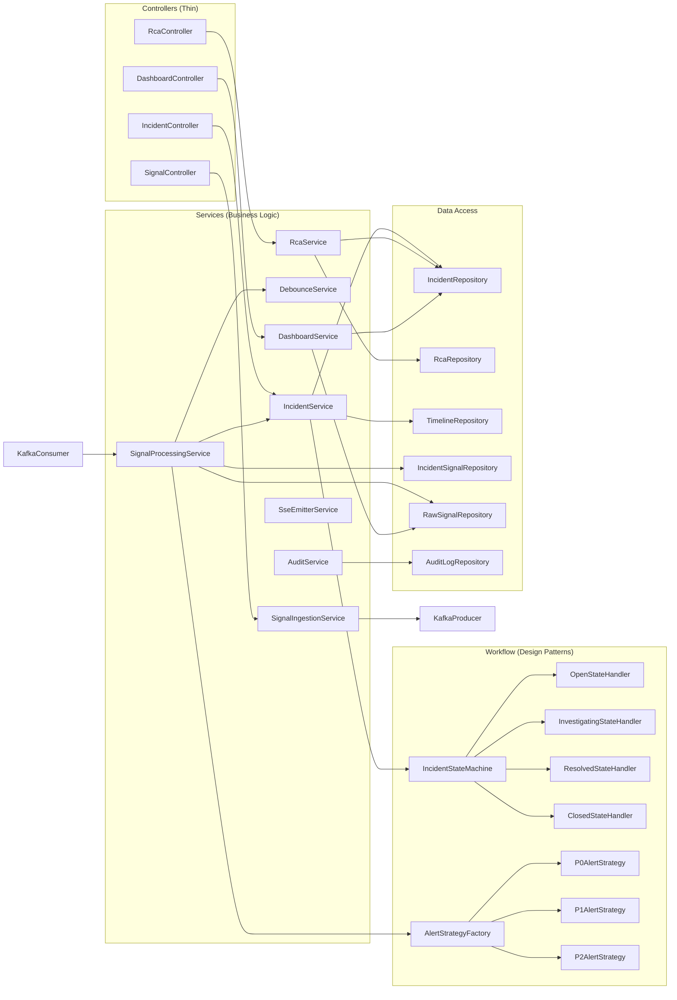

# Architecture Documentation

## System Architecture

```mermaid
C4Context
    title Mission-Critical Incident Management System

    Person(sre, "SRE Engineer", "Manages incidents and submits RCA")
    Person(agent, "Monitoring Agent", "Emits signals from infrastructure")

    System_Boundary(ims, "IMS Platform") {
        Container(api, "API Gateway", "Spring Boot 3", "Signal ingestion, REST API, Rate limiting")
        Container(kafka, "Kafka Cluster", "Apache Kafka", "Async signal pipeline, 6 partitions")
        Container(processor, "Signal Processor", "Kafka Consumer", "Debounce, incident creation")
        Container(workflow, "Workflow Engine", "State + Strategy", "State machine, alerting")
        ContainerDb(pg, "PostgreSQL", "RDBMS", "Incidents, RCA, Timeline")
        ContainerDb(mongo, "MongoDB", "Document Store", "Raw signals, Audit logs")
        ContainerDb(redis, "Redis", "Cache/Lock", "Debounce, dashboard cache")
        Container(frontend, "Dashboard", "React + TypeScript", "Real-time incident UI")
        Container(sse, "SSE Stream", "Server-Sent Events", "Real-time push updates")
    }

    System_Ext(prom, "Prometheus", "Metrics collection")
    System_Ext(grafana, "Grafana", "Dashboards & alerting")

    Rel(agent, api, "POST /api/v1/signals")
    Rel(api, kafka, "Publish signals")
    Rel(kafka, processor, "Consume batches")
    Rel(processor, redis, "Debounce check")
    Rel(processor, mongo, "Store raw signals")
    Rel(processor, workflow, "Create/update incidents")
    Rel(workflow, pg, "Persist state transitions")
    Rel(workflow, sse, "Push updates")
    Rel(sse, frontend, "SSE events")
    Rel(sre, frontend, "Manage incidents")
    Rel(frontend, api, "REST API calls")
    Rel(api, prom, "Expose /actuator/prometheus")
    Rel(prom, grafana, "Scrape metrics")
```

## Data Flow Sequence

```mermaid
sequenceDiagram
    participant Agent as Monitoring Agent
    participant API as Signal Controller
    participant Kafka as Kafka Topic
    participant Consumer as Signal Consumer
    participant Redis as Redis (Debounce)
    participant MongoDB as MongoDB
    participant PG as PostgreSQL
    participant SSE as SSE Stream
    participant UI as Frontend

    Agent->>API: POST /signals (SignalRequest)
    API->>API: Rate limit check
    API->>Kafka: Produce (key=componentId)
    API-->>Agent: 202 Accepted

    Kafka->>Consumer: Batch consume (500 records)

    loop For each signal
        Consumer->>MongoDB: Save RawSignal
        Consumer->>Redis: SETNX debounce:{componentId} TTL=10s
        alt First signal in window
            Redis-->>Consumer: true (window created)
            Consumer->>Redis: Acquire distributed lock
            Consumer->>PG: INSERT Incident (OPEN)
            Consumer->>Redis: Store incident ID
            Consumer->>Redis: Release lock
            Consumer->>SSE: Emit incident-update event
        else Existing window
            Redis-->>Consumer: false (window exists)
            Consumer->>Redis: INCR counter
            Consumer->>Redis: GET incident ID
            Consumer->>PG: Link signal to incident
            Consumer->>SSE: Emit incident-update event
        end
    end

    Consumer->>Kafka: Acknowledge batch

    SSE->>UI: Push incident update
    UI->>UI: Re-render dashboard
```

## State Machine Diagram

```mermaid
stateDiagram-v2
    [*] --> OPEN: Signal creates incident
    OPEN --> INVESTIGATING: Start investigation
    INVESTIGATING --> RESOLVED: Fix applied (MTTR calculated)
    INVESTIGATING --> OPEN: Reopen/escalate
    RESOLVED --> CLOSED: RCA submitted (mandatory)
    RESOLVED --> INVESTIGATING: Re-investigate
    CLOSED --> [*]: Terminal state

    note right of RESOLVED: Cannot close without RCA
    note right of INVESTIGATING: MTTR = resolvedAt - firstSignalAt
```

## Component Architecture

```mermaid
graph LR
    subgraph "Controllers (Thin)"
        SC[SignalController]
        IC[IncidentController]
        RC[RcaController]
        DC[DashboardController]
    end

    subgraph "Services (Business Logic)"
        SIS[SignalIngestionService]
        SPS[SignalProcessingService]
        DS[DebounceService]
        IS[IncidentService]
        RS[RcaService]
        DBS[DashboardService]
        AS[AuditService]
        SSE[SseEmitterService]
    end

    subgraph "Workflow (Design Patterns)"
        SM[IncidentStateMachine]
        OSH[OpenStateHandler]
        ISH[InvestigatingStateHandler]
        RSH[ResolvedStateHandler]
        CSH[ClosedStateHandler]
        ASF[AlertStrategyFactory]
        P0[P0AlertStrategy]
        P1[P1AlertStrategy]
        P2[P2AlertStrategy]
    end

    subgraph "Data Access"
        IR[IncidentRepository]
        RR[RcaRepository]
        TR[TimelineRepository]
        ISR[IncidentSignalRepository]
        RSR[RawSignalRepository]
        ALR[AuditLogRepository]
    end

    SC --> SIS
    IC --> IS
    RC --> RS
    DC --> DBS

    SIS --> KP[KafkaProducer]
    KC[KafkaConsumer] --> SPS
    SPS --> DS
    SPS --> IS
    IS --> SM
    SM --> OSH & ISH & RSH & CSH
    SPS --> ASF
    ASF --> P0 & P1 & P2

    IS --> IR & TR
    RS --> RR & IR
    SPS --> RSR & ISR
    AS --> ALR
    DBS --> IR & RSR
```
